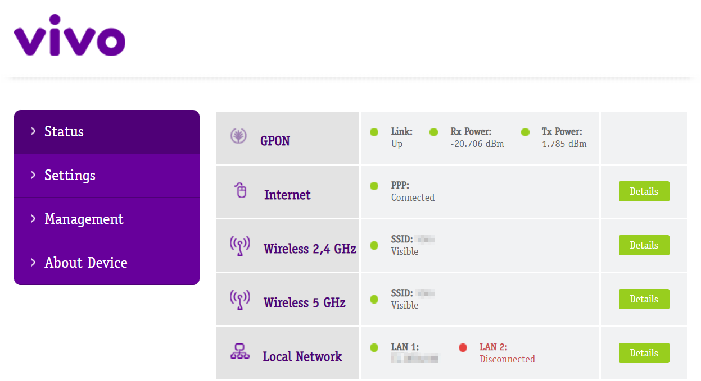

# Router Vis Extractor

A project to extract, persist and serve data from a router's state.


# Description

This program uses a router user interface to read status and statistics data from the router, saving updates and serving it as a JSON API.

A long-running background process maintains the session and watches variables for changes. Updates are saved in JSONL files separated by source, type, name, and hour (`./data/{source}-{type}/{name/{yyyy-mm-dd-hh}.json`).

The extraction requires a authorized connection (session) that is loaded from the `./data/session-id.txt` file or the `--session` argument.
The program will also perform authentication if credentials are provided: They can be specified by the `--user` and `--pass` program arguments or loaded from the `ROUTER_USERNAME` and `ROUTER_PASSWORD` environment variables. A sample file at `.env.sample` can be filled and renamed to `.env` too.

## How to use

Download with [git](https://www.git-scm.com/) and start it with [node.js](https://nodejs.org/), the project does not depend on any project to work:

```
git clone https://github.com/GuilhermeRossato/router-vis.git
cd router-vis
node index.js
```

You can execute the main script with either `npm run start`, `yarn start` or `node index.js`.

The initial setup will initialize the extraction server and begin streaming the network speed information. The extraction is done in a separated process so you can stop the script (with `Ctrl+C` or `Ctrl+D`) and it will continue persiting variable updates.

The background process can be disabled by including the `--standalone` flag argument or by configuring it as a default at `./settings.js`.

## Config / Arguments

```
--speed / --kbps / --mbps     Stream the differences of total usage data.
--usage / --kb / --mb / --gb  Stream the total usage data as kilobytes, megabytes or gigabytes.
--shutdown / --stop           Stop the background extraction process (if it is running).
--restart / --start / --init  Restart the background extraction server (stopping it first if needed).
--status / --info / -s        Request the current background server status and display it.
--api / --url / --open        Display and open the browser at the api url.
--standalone / --direct       Prevents the execution of the background process and start extraction.
--logs                        Stream the extraction server logs continuously.
--debug / -d                  Print extra execution logs.
--user <user>                 Specifies the username to use on authentication.
--pass <pass>                 Specifies the password to use.
--session <code>              Specifies a session id to use when extracting.
--server                      Executes the script as the background server.
--help / -h                   Display a help text with a link to this repository.
```

Default arguments can be configured at the root file `./settings.js`.

## Data Server / API

After executing the program once you can access the API by default at http://127.0.0.1:49737/.

You can use the `--api` / `--open` argument to launch your browser to it. The host and port of the internal server can be replaced by setting the `INTERNAL_DATA_SERVER_HOST` and `INTERNAL_DATA_SERVER_PORT` environment variables.

The API server routes can be listed at the [index](http://127.0.0.1:49737/api/index) endpoint. To get server status you can use the [status](http://127.0.0.1:49737/api/status) endpoint.

To read data from variables you can use the [data](http://127.0.0.1:49737/api/data) endpoint. If you define the `type` and the `src` variables it will list the variable names available. The response object will contain the acceptable (and alternatives) values at the `options` property.

For example, to read the latest usage data you can specify the `type`, `src` and `name` as `object`, `statistics`, `eth-intf-sts` at the [data](http://127.0.0.1:49737/api/data?type=object&src=statistics&name=eth-intf-sts) endpoint. You can also specify the `section` parameter to get updates of different interval. The `section` property at the response (inside `options` property) will contains the alternative values.

To read the latest extraction server logs you can use the [logs](http://127.0.0.1:49737/api/logs) endpoint.

## Motivation / Objective

The primary objective of this project is to experiment with project organization while learning some data-related skills.

Modern user-customer routers provides useful but instantaneous information such as fiber optical signal stregth, port routing, wifi status, connected hosts, wifi usage, uploaded bytes, etc. I wanted to analyze this data over time which is not available because customer-grade routers are hardware limited.

I reverse-engineered the HTTP interface of my router and implemented a process to authenticate, extract and save its data and its updates. The data can then be queried from a internal JSON API maintained by a background process.

## Dependencies

This project is executed with [Node.js](https://nodejs.org/) without any external or third-party dependencies so executing `npm install` is not necessary.

The project is intended to be used with a specific router software named _Vivo Box BR_SV_g000_R3505VWN1001_s42_. The router model code is _RTF3505VW-N2_.

The router's interface dashboard looks like this:


